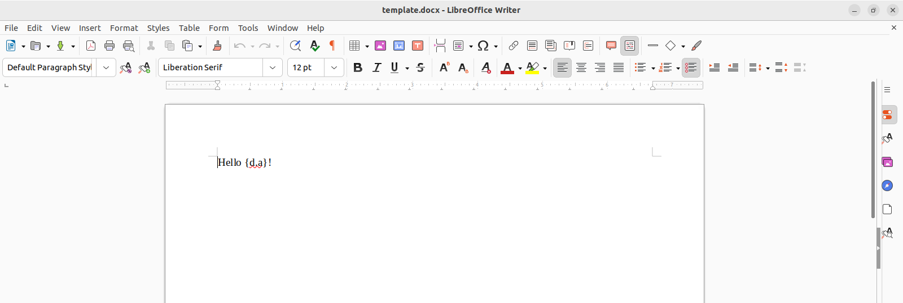
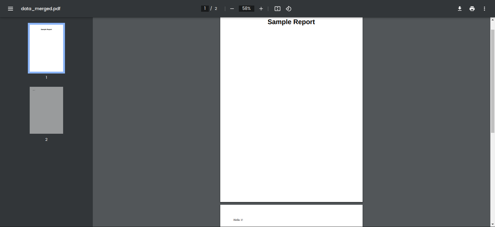

# n8n-nodes-carbonejs

This is an n8n community node. It lets you use [the Carbone JS library](https://carbone.io/) in your n8n workflows.

Carbone is a report generator that lets you render JSON data into DOCX, PDF, XLSX and more formats:

[n8n](https://n8n.io/) is a [fair-code licensed](https://docs.n8n.io/reference/license/) workflow automation platform.

> **NOTE:** Carbone is licensed under the [Carbone Community License (CCL)](https://github.com/carboneio/carbone/blob/master/LICENSE.md), which says that "Roughly speaking, as long as you are not offering Carbone Community Edition Software as a hosted Document-Generator-as-a-Service like Carbone Cloud, you can use all Community features for free.". AFAICT, this means that this plugin must also be distributed under CCL, and that you can't install it in a N8N instance and then use it to provide document generation as a service. You can use it for "your own internal business purposes" and "value-added products or services", as long as they aren't primarily document generation services.

[Installation](#installation)  
[Operations](#operations)  
[Compatibility](#compatibility)  
[Usage](#usage)  <!-- delete if not using this section -->  
[Resources](#resources)

## Installation

Follow the [installation guide](https://docs.n8n.io/integrations/community-nodes/installation/) in the n8n community nodes documentation.

## Operations

### Render Document

Must receive an input item with both `$json` and `$binary` keys. The `$json` key may be used to compose the "context", which will be provided to the templating engine. The `$binary` key should contain a DOCX document that contains a valid Carbone template.

### Convert to PDF

> **NOTE:** This operation requires LibreOffice to be installed. If using the native NPM install, you should install LibreOffice system-wide. If using the Docker images, you'd need to create a custom Docker image, based on `n8nio/n8n`, which also installs LibreOffice.

This node must receive items with a binary property containing a DOCX document. The selected document will be rendered into a PDF file using the LibreOffice renderer, since [according to one of the Carbone authors](https://github.com/carboneio/carbone/issues/41#issuecomment-528573164), "I tried to avoid LibreOffice because I wanted a tool really light and highly performant. But after many researches, I have never found a solution to convert a document more reliable than LibreOffice and which can run everywhere."

### Merge PDFs

This node takes two inputs, like the [Merge node](https://docs.n8n.io/integrations/builtin/core-nodes/n8n-nodes-base.merge/). Unlike the merge node, both inputs _must_ have the same amount of elements. The node will output a stream with the same amount of items, where every output item is the result of merging one element from `Input 1` and one element from `Input 2`, by position (i.e., first with first, second with second, and so on).

## Compatibility

This plugin has been developed and tested on N8N version 0.228.2. It should work with older versions too, but it hasn't been tested.

## Usage

### Basic usage: render to a DOCX file

The `Render` node needs to receive data items with _both_ JSON and [binary data](https://docs.n8n.io/courses/level-two/chapter-2/#binary-data). The binary data is the template, and the JSON data will be the context passed to the template.

To generate these data items, you'll probably want to use a [Merge Node](https://docs.n8n.io/integrations/builtin/core-nodes/n8n-nodes-base.merge), with Mode set to **Combine** and Combination Mode set to **Multiplex**. This generates a cross-join of all data in Input A and Input B (i.e., every possible combination of items). If you only input _one_ item in the template, you'll get one item out for each different JSON context.

See below for an example:

The Merge node receives 3 items in its Input A, and 1 item in its input B. Every possible combination yields 3*1 = 3 output combinations, each with the same template but different JSON content.

The data items output by the node will also have JSON and binary data. The JSON data is the context that was used for rendering the document (which is not necessarily the same as the node's input `$json` key), and the binary data is another DOCX document, rendered from the input Template.

### Complicated usage: render, convert to PDF, then add a static "cover page"

The workflow above is a more complicated version of the workflow, which uses everything that this node provides:

1. The rendering part is the same as above: the JSON contexts are generated somehow, the template is read from disk and replicated on every context, and then the Carbone node is used to render the documents
1. Every rendered document is converted to PDF
1. A "cover page" (a static PDF document) is read from disk and replicated on every PDF document (using the same Merge pattern as in the Simple Example above)
1. The Merge PDF node is used to add the cover letter at the start of every PDF document

Here's how the data looks at different points in the path (look for the yellow notes with letters):

A. The original template, which refers to a property in the context called `a`. Imagine that it's, say, the name of a user.

B. The document after being rendered, here with the context `{"a": 1}`

C. The same document, converted to a PDF file

D. The "cover page"

E. The document, now with the cover page added. Note that it has two pages, coming from two different documents

## Resources

* [n8n community nodes documentation](https://docs.n8n.io/integrations/community-nodes/)
* [General Carbone docs](https://carbone.io/documentation.html)
* [A short tutorial on template design](https://help.carbone.io/en-us/article/how-to-create-a-template-nm284z)
* [Detailed docs on template design](https://carbone.io/documentation.html#design-your-first-template)

